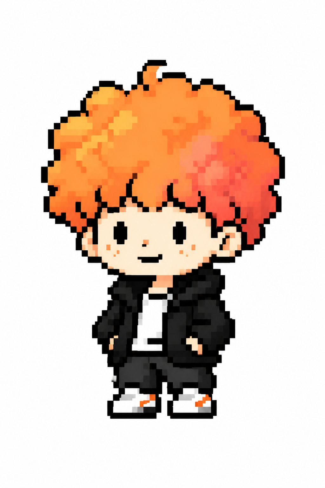

# Ian Orange Head Illustrations

> 把中文文章里的判断、流程、状态和隐喻，变成一张张有场景、橙色、清晰的像素正文配图。
>
> 16:9 横版 | 橘子头 IP | 场景化像素风 | 橙色主体 | 中文像素字体 | Codex Skill

---

## 这个仓库是什么?

Ian Orange Head Illustrations 是一个 Codex Skill，用来指导 AI Agent 为中文文章、帖子、博客、Notion 文档和方法论内容生成正文配图。

它不是通用插画 prompt，也不是 PPT 信息图模板。它的核心目标是：先理解文章里的认知锚点，再把其中一个判断、流程、结构、状态或隐喻，变成一张有记忆点的 16:9 像素解释图。

默认视觉 IP 是“橘子头”：一个大头小身、蓬松橙发、简单像素五官、穿黑白服装的 Q 版人物。橘子头不是贴纸或角落装饰，而是正在认真参与系统运转的核心行动者。

一句话：**让 AI 不只是“配一张图”，而是把文章里的一个关键认知动作画出来。**

---

## 适合谁用

特别适合：

- 写中文文章，需要正文配图和文章插图的人
- 做知识型内容、方法论内容、AI 工作流内容的人
- 想把抽象判断画成具体隐喻的人
- 想要一种比 PPT 信息图更轻、更怪、更有个人识别度的配图风格的人
- 用 Codex 做内容生产，希望稳定复用一套视觉语言的人

不适合：

- 想要商业插画、品牌 KV 或精致扁平插画的人
- 想要传统 PPT 信息图、复杂架构图或流程图的人
- 想要低幼吉祥物、表情包或儿童卡通风格的人
- 想把大量正文、长段解释或完整课程页塞进一张图里的人
- 需要严格可编辑矢量源文件的人

---

## 它会产出什么

默认输出：

- 16:9 横版正文配图
- 一篇文章的 4-8 张 shot list
- 每张图的主题、核心意思、结构类型、橘子头动作和中文标注建议
- 最终 PNG 图片，保存到 workspace 的 `assets/<article-slug>-illustrations/`

默认不输出：

- PPTX / PDF / Keynote
- SVG / HTML / Canvas 可编辑图
- 商业海报或封面 KV
- 大段文字型信息图

---

## 视觉风格

这个 skill 默认使用 Ian 的“橘子头像素正文配图”风格：

- 根据当前主题和角色动作设计简洁像素背景，不让角色悬浮在空白画布中
- 背景低细节、低对比，只保留帮助叙事的环境元素
- 清晰的方形像素块和阶梯状边缘
- 大量留白，主体只占画面约 40%-60%
- 橙色主体，黑色、白色和深灰色辅助
- 少量清晰的中文像素字体批注
- 一张图只表达一个核心动作、结构、状态或隐喻
- 橘子头必须参与核心动作，不能只是装饰
- 有创意、清爽、有趣，但不低幼

---

## 角色参考



这张图片用于校准橘子头的身份、比例、颜色和像素风，不是构图模板。使用时应根据当前文章重新设计动作、物件和场景。

---

## 安装

克隆仓库：

```bash
git clone https://github.com/ZHIXIANGMO/ian---illustrations.git
cd ian---illustrations
```

复制 skill 到 Codex skills 目录：

```bash
mkdir -p "${CODEX_HOME:-$HOME/.codex}/skills"
cp -R ./ian-orange-head-illustrations "${CODEX_HOME:-$HOME/.codex}/skills/"
```

安装后，在 Codex 里使用：

```text
Use $ian-orange-head-illustrations 为这篇中文文章设计并生成 5 张橘子头像素正文配图。
```

---

## 怎么用

### 只做配图规划

```text
Use $ian-orange-head-illustrations 先不要生图。
请分析下面这篇文章哪里值得配图，输出 5 张左右的 shot list。
每张图写清楚：放在哪段后、主题、核心意思、结构类型、橘子头在做什么、建议中文标注词。

<粘贴文章>
```

### 直接生成正文配图

```text
Use $ian-orange-head-illustrations 把下面这篇文章生成 4 张橘子头像素正文配图。
要求：16:9 横版、背景符合当前画面、橙色主体、清晰像素块、少量中文像素字体批注。

<粘贴文章>
```

### 为单个概念生成一张图

```text
Use $ian-orange-head-illustrations 为“信任不是喊出来的，而是一块证据一块证据铺过去”生成一张正文配图。
画面要清爽、有趣，橘子头必须承担核心动作。
```

### 去掉图里的标题或错误文字

```text
Use $ian-orange-head-illustrations 帮我编辑这张图，去掉左上角的“流程图”标题，其他内容保持不变。
```

更多示例见 [examples/prompts.md](examples/prompts.md)。

---

## 工作流程

这个 skill 的流程是：

1. 读取文章、Markdown、Notion 内容、截图或用户给的主题
2. 提炼核心观点、认知转折、流程结构和适合视觉化的段落
3. 先输出 shot list：每张图只选一个认知锚点
4. 为每张图选择结构类型：Workflow、系统局部、前后对比、角色状态、概念隐喻、方法分层、地图路线或小漫画分镜
5. 重新发明一个低科技、怪诞但成立的物理隐喻
6. 让橘子头承担核心动作
7. 每张图单独调用图像模型生成
8. 按 QA checklist 检查：场景背景、视觉呼吸空间、橘子头身份与动作、像素字体、橙色主体、非 PPT 感
9. 保存最终 PNG，并报告用途和路径

---

## 目录结构

```text
.
├── README.md
├── LICENSE
├── NOTICE.md
├── assets/
│   └── ian-wechat-qr.jpg
├── examples/
│   └── prompts.md
└── ian-orange-head-illustrations/
    ├── SKILL.md
    ├── agents/
    │   └── openai.yaml
    ├── assets/
    │   └── orange-head-reference.png
    └── references/
        ├── style-dna.md
        ├── orange-head-ip.md
        ├── composition-patterns.md
        ├── prompt-template.md
        └── qa-checklist.md
```

真正需要安装到 Codex 的是子目录：

```text
ian-orange-head-illustrations/
```

根目录的 README、LICENSE、NOTICE 和 examples 是 GitHub 分享文档。

---

## 注意事项

- 图片里的中文文字越短越稳定。
- 每张图只讲一个核心结构，不要把文章做成说明书。
- 橘子头必须承担核心动作；如果去掉橘子头画面仍然完全成立，说明角色太装饰了。
- 角色参考图只用于校准身份、比例、颜色和像素风，不要复刻站姿或构图。
- AI 图像模型可能出现错字、幻觉标签、风格漂移或多余标题，生成后需要检查。
- 如果中文错字严重，优先减少标注词并重生成。

---

## 相关项目

- [Ian Handdrawn PPT](https://github.com/helloianneo/ian-handdrawn-ppt) — 中文手绘技术 PPT-style 页面图生成 Skill
- [Awesome Claude Code Skills](https://github.com/helloianneo/awesome-claude-code-skills) — Claude Code Skills / Agents / Plugins 精选合集
- [Obsidian + Claude AI Second Brain](https://github.com/helloianneo/obsidian-ai-second-brain) — Obsidian + Claude AI 个人知识库搭建指南

---

## 关于作者

**Ian (伊恩)** — 产品设计师 / 一人公司实践者 / AI Builder

用 AI 团队打造一人公司。

- GitHub: [helloianneo](https://github.com/helloianneo)
- X/Twitter: [@ianneo_ai](https://x.com/ianneo_ai)
- 网站: [www.ianneo.xyz](https://www.ianneo.xyz)
- 微信: `ianneoxyz`
- 邮箱: hello.neoc@gmail.com

---

## 继续探索

这套橘子头配图 Skill，只是我用 AI 搭建个人生产系统里的一个小工具。

如果你也在用 AI 做内容、知识库、工作流或产品化，可以继续看我的网站：[www.ianneo.xyz](https://www.ianneo.xyz)。

只想先观察，可以关注我的 [X/Twitter](https://x.com/ianneo_ai)。

想了解 Indie Builders Club，加微信：`ianneoxyz`，备注「OPC」。

<p>
  
</p>

不方便扫码也可以搜索微信：`ianneoxyz`。

---

## License

MIT License. See [LICENSE](LICENSE).
